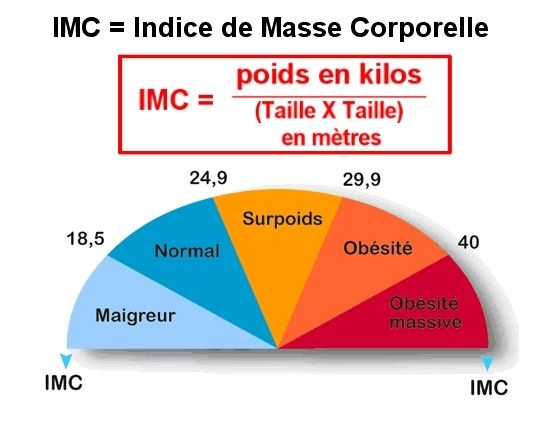

# Digital Campus 2019/2020 - Algorithmie de la Data
# Premiers pas en Python

## Exercice 1: calcul d'IMC

On se propose d'implémenter un programme qui permet de calculer l'IMC d'une personne.

### L'idée
 
L'utilisateur saisit sa taille et son poids et on lui affiche un message qui indique son IMC et sa catégorie (maigreur, normal, surpoids, obésité ou obésité morbide).

Les étapes de l'agorithme sont les suivantes:

1. Identifier les données d'entrées et initialiser les variables correspondantes
2. Calculer l'IMC
3. Afficher la catégorie correspondant à l'IMC

> Créer un nouveau fichier Python `imc.py` dans le dossier tp1/

### Récupérer les données d'entrées

1. Quelles sont les deux variables que nous devons récupérer? Quel est leur type?

2. A l'aide de la fonction `print`, demander à l'utilisateur de saisir sa taille.

3. A l'aide de la fonction `input()`, récupérer la valeur saisie par l'utilisateur et stocker le résultat dans une variable `taille_saisie`.

4. Quel est le type de la variable `taille_saisie` ?

5. Créer une variable de type entier `taille` qui contient la valeur de `taille_saisie` à l'aide de l'instruction suivante:
    
    `taille = int(taille_saisie)` 

6. Demander à l'utilisateur de saisir son poids et stocker le résultat dans une variable `poids` de type décimal. On pourra utiliser la fonction `float` qui permet de transformer une chaîne de caractère en nombre décimal.

### Calcul de l'IMC

1. A partir des valeurs contenues dans `taille` et `poids`, calculer l'IMC de l'utilisateur et stocker le résultat dans une variable nommée `imc`

2. Afficher la valeur de l'IMC calculé.

### Afficher la catégorie

1. Identifier les critères qui définissent la catégorie d'un IMC.

2. Quelle structure conditionnelle doit-on utiliser pour afficher cette catégorie?

3. A l'aide des mots-clé `if`, `elif` et `else`: afficher la catégorie de l'IMC.

## Exercice 2: deviner un nombre

On se propose d'implémenter un jeu dans lequel l'utilisateur doit deviner un nombre.

### Le principe

* Le programme tire un nombre au hasard
* L'utilisateur propose un nombre
* Le programme lui indique si ce nombre est trop petit ou trop grand

Et ainsi de suite jusqu'à ce que l'utilisateur trouve le bon nombre.

> Créer un nouveau fichier Python `guess_number.py` dans le dossier tp1/

### Etapes

**Tirage d'un nombre aléatoire:**

De base, Python ne propose pas de fonction pour tirer un nombre aléatoire. On va utiliser donc une fonction externe.
    
1. A l'aide de l'instruction `from random import randint`, importer la fonction `randint` qui permet de générer un nombre aléatoire.
    
2. Pour savoir comment utiliser cette fonction, afficher l'aide en exécutant l'instruction `help(randint)` 
    
3. Créer une variable `number_to_guess` qui contient un nombre aléatoire compris entre 1 et 10.

**Demander un nombre à l'utilisateur:**

1. Demander à l'utilisateur de saisir un nombre entre 1 et 10

2. Stocker le résultat dans une variable de type entier nommée `user_propal`

3. Vérifier que la valeur de `user_propal` est comprise entre 1 et 10. Si non: 

   * Afficher un message d'erreur à l'utilisateur

**Vérifier la valeur du nombre saisi:**

1. Afficher un message à l'utilisateur qui indique si le nombre qu'il a saisi est:
    * égal à `number_to_guess`
    * plus petit que `number_to_guess`
    * ou plus grand que `number_to_guess`

### Implémenter une première version du jeu

Implémenter une première version du jeu de la manière suivante:

1. Générer un nombre à deviner compris entre 1 et 10

2. Demander un nombre à l'utilisateur

3. Vérifier la valeur du nombre:

    * Si le nombre n'est pas compris entre 1 et 10 :
       * On affiche un message d'erreur et on arrête le programme.
    
    * Si le nombre est égal:
        
        * l'utilisateur a gagné. On lui affiche un message de victoire et on arrête le programme.
    
    * Sinon:
    
        * indiquer à l'utilisateur si le nombre qu'il a saisi est trop petit ou trop grand
      
Répéter les étapes 2 et 3 jusqu'à ce que l'utilisateur trouve le bon nombre.

__Indications:__

- Créer une variable `has_won` de type booléen, initialiser sa valeur à `False`
- A l'aide du mot-clé `while`, créer une boucle qui répéte les opérations suivantes tant que `has_won` vaut `False`:
    * demander un nombre à l'utilisateur 
    * vérifier la valeur du nombre saisi: si le nombre est correct alors `has_won` vaut `True`
    
### (Bonus) Version définitive du jeu

Principe:

* Le programme tire un nombre au hasard compris entre 0 et 100
* L'utilisateur propose un nombre
* Si le nombre proposé est correct:
    * L'utilisateur a gagné
    * Sinon le programme lui indique si ce nombre est trop petit ou trop grand

L'utilisateur dispose de 5 tentatives pour deviner le nombre.
